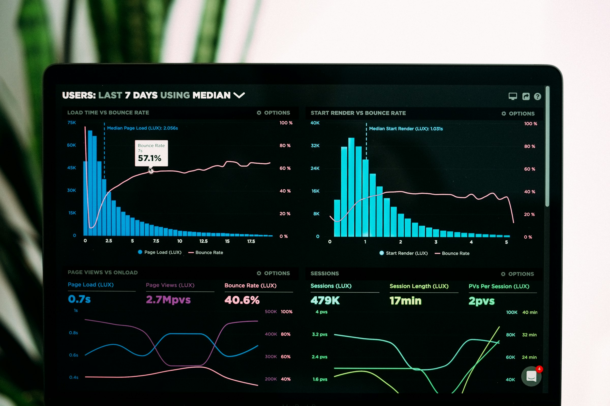

# The Outlier Score Explained: A Smarter Way to Predict TikTok's Next Viral Trend

Raw view counts reward creators who are already huge. A celebrity account posting a mediocre clip can still out-view a small creator's genuinely exceptional one, simply because of audience size. That makes view count alone a poor signal for finding formats worth studying.

An outlier score fixes this by asking a different question: not how many views did this get, but how far did it travel relative to what this creator normally reaches. That shift is what makes VVF's Outlier Score useful for research rather than just spectacle.

*Photo by [Denise Chan](https://unsplash.com/photos/i-EZGbJOMKQ) on [Unsplash](https://unsplash.com/) · [Unsplash License](https://unsplash.com/license)*

## What the Outlier Score Actually Measures

VVF's Outlier multiplier compares a video's views with the creator's Audience Base. A video with 173,900 views and an Audience Base of 5 shows an outlier of roughly 34,780×. That number describes scale relative to the account's normal reach, not a prediction of what will happen next.

A creator with 2 million followers posting a video that gets 3 million views has performed well, but the outlier is modest. A creator with 400 followers whose video gets 500,000 views has an outlier so large it signals something unusual happened in the format, hook, or distribution — something worth studying regardless of the creator's size.

## Why Raw View Count Misleads Research

Large accounts benefit from an existing audience, prior algorithmic trust, and cross-promotion. Their high view counts are partly a function of who they already are, not necessarily what they made. Studying only top-of-feed, high-follower content risks copying advantages you do not have instead of copying structures you can actually use.

Small accounts with outsized results carry a different kind of signal. Nothing external explains the reach — the video itself did the work. That is closer to what an independent creator, brand account, or agency can realistically reproduce.

## How to Read an Outlier Score Correctly

An outlier score is not a virality forecast. It describes something that already happened, not something that will happen again. Keep three distinctions in mind:

- High outlier, low raw views: often the most useful research target. The structure clearly outperformed the account's normal reach, even if the absolute number looks small.
- High outlier, high raw views: rare and worth close attention. The video reached far beyond its base and still accumulated meaningful volume.
- Low outlier, high raw views: expected for large accounts. Useful for studying production quality or brand alignment, less useful for isolating what made the hook or structure work.

*Photo by [Luke Chesser](https://unsplash.com/photos/graphs-of-performance-analytics-on-a-laptop-screen-JKUTrJ4vK00) on [Unsplash](https://unsplash.com/) · [Unsplash License](https://unsplash.com/license)*

## Using Outlier Score Inside a Research Workflow

VVF's TikTok dashboard lets you filter by posted-within period, follower-count range, and category, then sort by Outlier Score or views. Start with a narrow category and a recent time window, then sort by Outlier Score to surface videos that overperformed their Audience Base rather than videos that simply belong to large accounts.

Open a strong candidate in Video Analysis. The AI summary and Why It Went Viral breakdown outline what likely drove the result, while Top Outlier Drivers point to specific contributing factors. The first-three-second hook analysis scores the opener and suggests hook ideas, and the copyable timestamped transcript lets you study pacing without rewatching repeatedly. Creative Strategist adds guidance on format, tone, pacing, recording, what to show, and what to say, and the Script Builder turns that research into an editable Topic-to-Script draft.

*Photo by [lonely blue](https://unsplash.com/photos/a-close-up-of-a-computer-screen-with-a-chart-on-it-466y_VoFM-k) on [Unsplash](https://unsplash.com/) · [Unsplash License](https://unsplash.com/license)*

## Frequently Asked Questions

### Is a high Outlier Score the same as a guaranteed viral hit?
No. It describes how far a specific video already traveled relative to the creator's Audience Base. It does not predict how a new video, even in the same format, will perform.

### Should I only study videos with the highest possible outlier?
Not exclusively. Extremely high outliers can come from unusual one-off circumstances. Look for formats that produce strong outliers repeatedly, across more than one creator or post, before treating a structure as reliable.

### Can a large creator ever have a meaningful outlier score?
Yes, though it is less common. If a video reaches views far beyond even a large existing audience, the outlier can still be significant and worth studying.

### Does VVF calculate Outlier Score for every video in its dashboard?
Yes. Every video VVF surfaces includes an Outlier multiplier based on views relative to Audience Base, which you can use as a primary sort alongside raw views.

## Start Sorting by Signal, Not Size

Raw views tell you what already had an advantage. Outlier Score tells you what earned its reach. Use VVF's dashboard to filter by category and recency, sort by Outlier Score, and study the videos whose structure — not whose follower count — did the work.

## Related Reading

- [10 TikTok Video Ideas That Can Go Viral in 2026](../tiktok-video-ideas-2026/article.md)
- [How to Reverse-Engineer a Viral TikTok Video](../reverse-engineer-viral-video-2026/article.md)
- [Top 10 Websites to Find Viral TikTok Videos and Trends in 2026](../top-tiktok-websites-2026/article.md)

## Sources and Further Reading

- How TikTok recommends content: https://support.tiktok.com/en/using-tiktok/exploring-videos/how-tiktok-recommends-content
- TikTok Creative Center: https://ads.tiktok.com/business/creativecenter/
