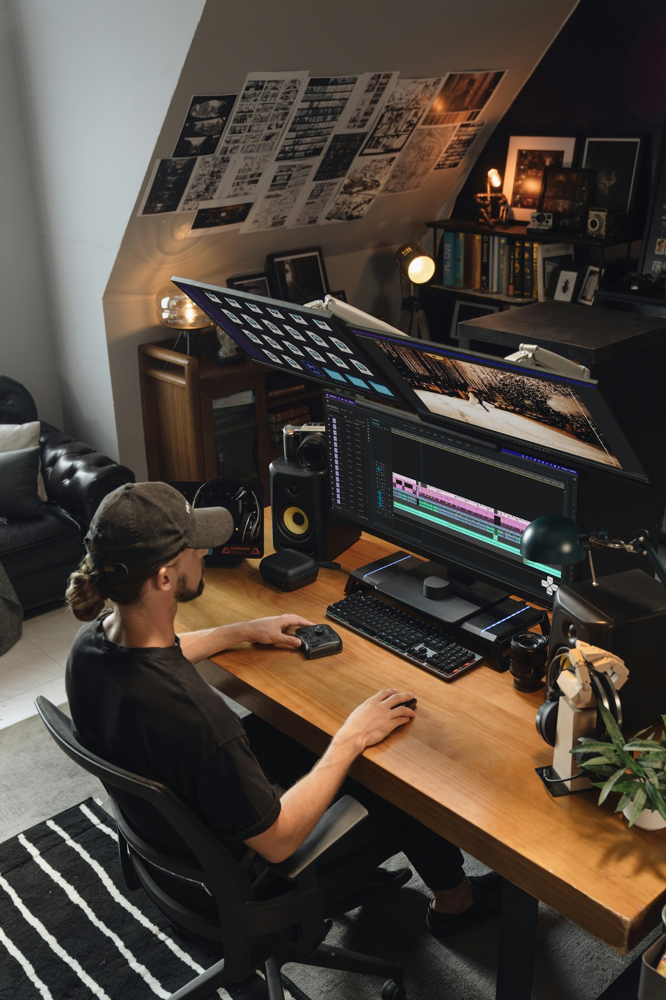

# How to Reverse-Engineer a Viral TikTok Video: A Step-by-Step Framework

Watching a viral video and hoping to absorb why it worked is not a research method. A useful breakdown separates a video into its parts — hook, structure, proof, pacing, and payoff — so you can identify the mechanism instead of just the impression.

This is not about copying footage, scripts, or a creator's distinctive style. It is about understanding the underlying structure well enough to build an original version for your own audience.

*Photo by [TourBox](https://unsplash.com/photos/a-person-edits-video-at-a-modern-computer-setup-xGklNeRfBK8) on [Unsplash](https://unsplash.com/) · [Unsplash License](https://unsplash.com/license)*

## Step 1: Find a Video Worth Analyzing

Start with a video whose performance is meaningfully unusual relative to the creator's normal reach, not simply a video with a high raw view count from a large account. VVF's TikTok dashboard filters by posted-within period, follower-count range, and category, then sorts by Outlier Score or views, which helps you find videos whose structure — not their existing audience — likely drove the result.

## Step 2: Deconstruct the First Three Seconds

Watch only the opening. Identify what promise, question, or contradiction it sets up, and note whether the topic is clear immediately or takes time to establish.

VVF's Video Analysis includes a scored first-three-second hook breakdown with hook ideas, which gives you a reference point for what made the opener effective before you move on to the rest of the video.

## Step 3: Map the Structure With the Transcript

Use VVF's copyable timestamped transcript to lay out the video's structure without repeatedly rewatching it. Identify where the setup ends, where the main content or demonstration happens, and where the payoff or resolution lands.

Look for the ratio between setup and payoff. Many strong videos spend very little time on preamble and reach useful content quickly.

## Step 4: Identify the Proof and the Payoff

Ask what evidence the video offers to support its claim or promise — a demonstration, a result, a before-and-after, or a specific number. Then ask whether the ending delivers on exactly what the hook promised, or whether it drifts into a different point.

A gap between the hook's promise and the video's actual payoff is often a weakness even in an outlier video — one worth avoiding when you build your own version.

*Photo by [BandLab](https://unsplash.com/photos/a-person-using-a-laptop-gjqL19jYoAI) on [Unsplash](https://unsplash.com/) · [Unsplash License](https://unsplash.com/license)*

## Step 5: Note the Delivery Details

Pacing, on-screen text timing, camera framing, and where cuts happen all shape how a video feels, independent of the script. VVF's Creative Strategist adds guidance on format, tone, pacing, recording, what to show, and what to say, which helps translate what you observed into practical notes for your own recording.

## Step 6: Rebuild an Original Version

Take the structure — not the wording, footage, or on-screen branding — and rebuild it around your own topic, evidence, and voice. VVF's Script Builder organizes this into Topic, Research, Hook, and Script steps, with editable drafts, regeneration, hook-sync warnings, and script history, so the analysis turns into a usable draft rather than notes that never get used.

## A Simple Deconstruction Checklist

- What does the hook promise in the first three seconds?
- Where does the setup end and the main content begin?
- What proof or demonstration supports the claim?
- Does the payoff fully deliver on the hook's promise?
- What pacing and editing choices support clarity?
- What would an original version of this structure look like for my topic?

*Photo by [Amjith S](https://unsplash.com/photos/a-close-up-of-a-computer-screen-with-a-bar-chart-on-it-6F4qEDIcY1g) on [Unsplash](https://unsplash.com/) · [Unsplash License](https://unsplash.com/license)*

## Frequently Asked Questions

### Is reverse-engineering a viral video the same as copying it?
No, if done correctly. The goal is to understand the structure well enough to build a distinct, original video. Copying scripts, footage, or a creator's identifiable style is different from studying a format.

### How many videos should I analyze before I have a reliable pattern?
Analyzing only one video risks mistaking a one-off result for a repeatable structure. Compare several outlier videos in the same category before concluding that a specific structure is reliable.

### Do I need special software to reverse-engineer a video?
No, though tools that provide a summary, hook score, and transcript save significant time compared with manually rewatching and transcribing each video.

### Can VVF do this analysis automatically?
VVF's Video Analysis provides an AI summary, Why It Went Viral breakdown, hook scoring, a timestamped transcript, and Creative Strategist guidance for any video in its dashboard, which supports each step of this framework.

## Turn Analysis Into an Original Draft

Reverse-engineering only pays off if it leads somewhere. Use VVF to find an outlier video, deconstruct its hook, structure, proof, and payoff, then build an original draft in the Script Builder before testing it with your own audience.

## Related Reading

- [The Outlier Score Explained](../outlier-score-explained-2026/article.md)
- [7 Viral Hook Templates Dominating TikTok in 2026](../viral-hook-templates-2026/article.md)
- [Why Your TikTok Video Has 0 Views (and How to Fix It)](../tiktok-zero-views-2026/article.md)

## Sources and Further Reading

- How TikTok recommends content: https://support.tiktok.com/en/using-tiktok/exploring-videos/how-tiktok-recommends-content
- TikTok Creative Center: https://ads.tiktok.com/business/creativecenter/
